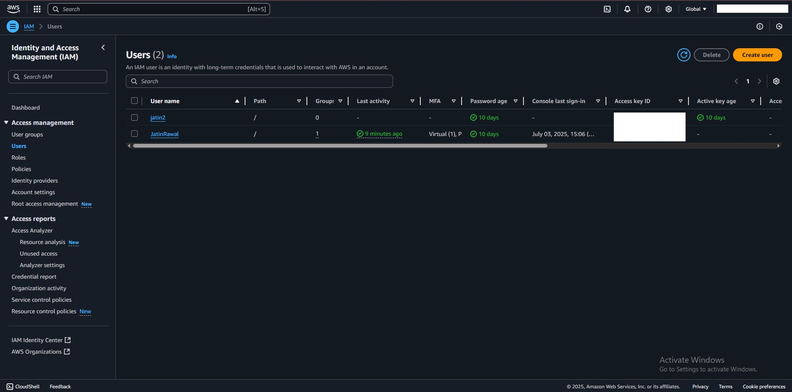
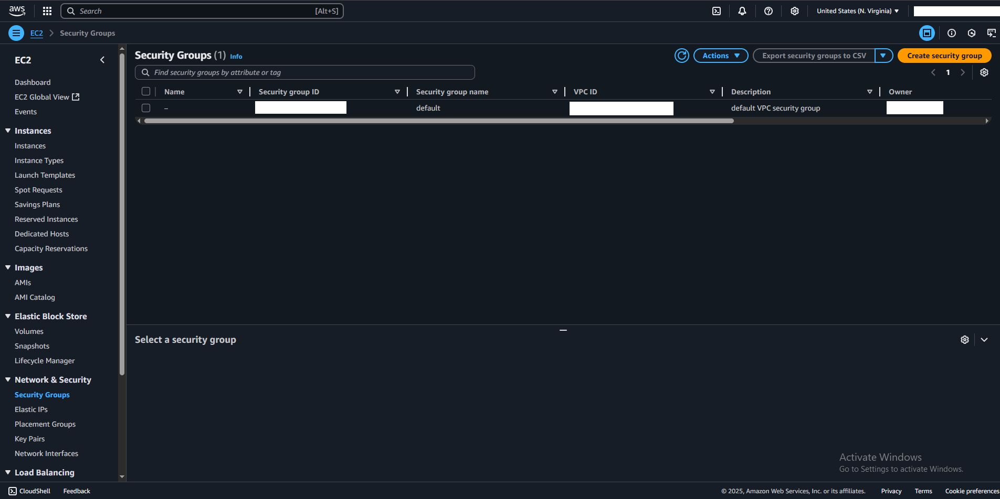

# 🛡️ AWS Cloud Security Journey (Hands-On)

Hey! I'm learning AWS Cloud Security step-by-step and documenting everything here.  
Follow along if you're also diving into IAM, EC2, and all things secure in the cloud ☁️🔐

---

## 🔐 IAM: Identity & Access Management
- Created IAM users and groups
- Attached least-privilege policies
- Used policy simulator for testing
- Learned about MFA and root account safety

---

## ⚙️ EC2 & Security Groups
- Launched EC2 instances (Amazon Linux)
- Configured security groups to:
  - Allow SSH (port 22) only from my IP
  - Allow HTTP (port 80) for web traffic
  - Blocked unnecessary open ports

---

## 🧠 What I Learned
- Never leave ports open to 0.0.0.0/0 without a good reason
- IAM roles > hardcoded credentials
- EC2 + Security Group = powerful combo when used right

---

## 📍 Next Steps
- Configure and secure S3 buckets
- Learn about encryption (KMS, SSL, etc.)
- Explore logging with CloudTrail

---

## 💬 Let’s Connect!
If you’re also into cloud security or just starting out — drop a ⭐ or connect on [LinkedIn](https://www.linkedin.com/in/jatin-rawal-79b225360/)

